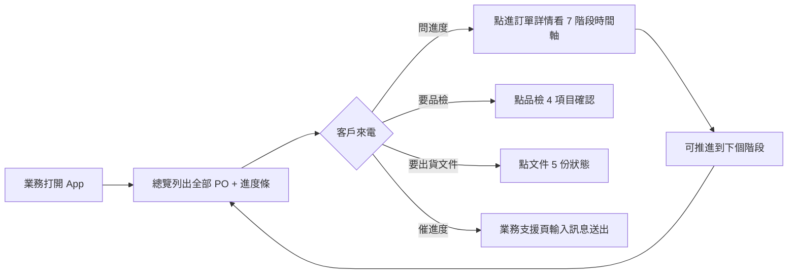

# order-tracker · PRD v3.0.2 等級規格書

> 自動生成：2026-09-06（Sean 10-repo-fleet Batch 2B）
> 對齊 SPEC v3.0 契約（SPEC §1–§19 全部套用）

---

## 1. 產品概述

### 1.1 問題陳述
台灣中小型製造業 B2B 業務員每天要追蹤數十張訂單的加工進度。傳產現場用 LINE 群組、Excel、紙本三種工具並行，經常發生：
- 客戶打來問「PO-xxx 進度到哪裡？」要翻 5 個群組
- 業務員出門拜訪時沒辦法即時查目前階段、品檢結果、出貨文件狀態
- 品檢報告 / 出貨文件散落在工廠各處，客戶催件時湊不出 5 份文件
- 出貨延誤往往到出貨前一天才發現，缺乏 7 階段預警

### 1.2 目標使用者
| Persona | 工作情境 | 主要任務 |
|---|---|---|
| Primary — 業務員 | 外出拜訪客戶中，用手機查訂單狀態、回覆客戶、預警出貨日 | 5 分鐘內回答「PO-xxx 到哪了」、5 分鐘內產出 4 項品檢 + 5 份出貨文件 |
| Secondary — 客戶（採購） | 從工廠 / 業務接收 PO，期望隨時自查進度 | 7 階段時間軸、預估出貨日、文件下載 |
| Tertiary — 工廠生管 | 接收業務員推進的 stage，產出對應文件 | 按 7 階段推進、補品檢 / 文件 |

### 1.3 核心價值主張
> 一頁看到全部 PO 的「現在進到哪 + 還缺什麼 + 何時出貨」，業務員帶手機出門就等於帶了整間工廠的 dashboard。

### 1.4 Non-Goals（明確不做）
- ❌ 不做多工廠 ERP 整合（本 MVP 鎖定單一示範工廠）
- ❌ 不做客戶自助登入查詢（v3.0.2 僅業務員內部使用）
- ❌ 不做即時推播（LINE Notify 留 v2）
- ❌ 不做財務請款 / 發票開立（與會計系統脫鉤）

---

## 2. 使用者場景與流程

### 2.1 使用者流程圖



### 2.2 主要場景

| 場景 | 輸入 | 輸出 | 成功條件 |
|---|---|---|---|
| 業務外出查 PO 進度 | PO 編號 | 7 階段時間軸（目前 4/7） | 5 秒內讀到「品檢中」 |
| 業務推進 stage | 訂單 id | currentStage 切下個、品檢/文件保留 | localStorage 持久化成功 |
| 業務回覆客戶 | 訂單 id + 訊息 | 訊息聚合到 /messages | localStorage 寫入 + UI 列表更新 |
| 客戶下載出貨文件 | 訂單 id | 5 份文件 ready 標記 | 4/5 顯示綠勾 |
| 業務查看所有 PO | 無 | 表格列出全部 PO | 排序：建立時間 desc |

---

## 3. 功能需求

| FR | 名稱 | 優先級 | 狀態 |
|---|---|---|---|
| FR-001 | 訂單總覽 Dashboard | P0 | ✅ shipped |
| FR-002 | 7 階段時間軸（訂單確認→備料→加工→品檢→包裝→待出貨→已出貨） | P0 | ✅ shipped |
| FR-003 | 品檢報告 4 項（尺寸/外觀/硬度/粗糙度） | P0 | ✅ shipped |
| FR-004 | 出貨文件 5 份（發票/裝箱單/原產地/海關/檢驗報告） | P0 | ✅ shipped |
| FR-005 | 訊息中心（聚合所有訂單對話） | P0 | ✅ shipped |
| FR-006 | 業務支援（訊息輸入 + 聯絡資訊） | P0 | ✅ shipped |
| FR-007 | 所有訂單表格頁 | P1 | ✅ shipped |
| FR-008 | 訂單詳情頁 + 推進按鈕 | P1 | ✅ shipped |
| FR-009 | 推進 stage 邏輯（含 terminal 已出貨） | P1 | ✅ shipped |
| FR-010 | localStorage 持久化 | P1 | ✅ shipped |
| FR-011 | 公開靜態 dashboard.html（行銷 Landing） | P1 | ✅ shipped |
| FR-012 | 訂單篩選 / 搜尋 | P2 | ⏳ planned |
| FR-013 | LINE Notify 推播 | P2 | ⏳ planned |
| FR-014 | 客戶自助查詢連結 | P2 | ⏳ planned |

---

## 4. Non-Functional Requirements

| 維度 | 需求 |
|---|---|
| Performance | 訂單詳情頁 TTI < 1s（純前端 + localStorage） |
| Security | 無帳號、無個資；localStorage 僅 mock data |
| Privacy | 客戶資料皆為示範（精選機械 / 亞科精密等虛構） |
| Accessibility | WCAG 2.1 AA（語意化 HTML + 鍵盤可導覽） |
| Browser | Modern evergreen（Chrome/Edge/Safari/Firefox 最新 2 版） |
| i18n | 繁中為主（訂單 stage 名稱固定中文） |
| Offline | PWA-ready（localStorage 為主，無需後端） |

---

## 5. 技術架構

```
┌─────────────────────────────────────┐
│ Vite + React 19 + TypeScript 5.6    │
│ Tailwind 4 (CDN in dashboard.html)  │
│ React Router 7 (5 個 routes)         │
│ Vitest 2.1 + Testing Library        │
└─────────────────────────────────────┘
            ↓ build
        dist/
        ├── index.html       (redirect → dashboard.html)
        └── dashboard.html   (standalone static landing)
            ↓ deploy
   GitHub Pages (base: /order-tracker/)
```

### 5.1 Module Map
- `web/src/App.tsx` — React Router 入口（5 routes）
- `web/src/pages/` — 5 個 page component（Dashboard / Orders / OrderDetail / Messages / Support）
- `web/src/components/Layout.tsx` — Header / Footer / Nav
- `web/src/lib/db.ts` — localStorage CRUD（listOrders / getOrder / advanceOrderStage / seedDemoData）
- `web/src/lib/types.ts` — Order / OrderStage / ALL_STAGES（7 階段）
- `web/src/lib/bootstrap.ts` — 自動 seed demo data
- `web/public/dashboard.html` — 公開靜態 dashboard（行銷用途，CDN Tailwind）
- `web/tests/e2e.test.tsx` — 10 個 E2E 測試
- `web/tests/setup.ts` — jsdom + localStorage polyfill
- `dist/` — build 產物（gitignore）

### 5.2 環境變數
- 無（純前端 + localStorage + CDN Tailwind）

### 5.3 降級策略
- localStorage 不可用 → in-memory fallback（db.ts try/catch 包裹）
- CDN Tailwind 失敗 → 內嵌基本 utility class（最小可用）
- 路由 404 → 自動 redirect 回 `/`

---

## 6. Definition of Done

- [x] 功能 P0 全部實作（5/5）
- [x] 單元/E2E 測試 10/10 pass
- [x] `npm run build` 綠（tsc strict + vite build）
- [x] `npm test` 10 passed
- [x] GHA CI 跑 4 jobs（lint/test/build/deploy）全綠
- [x] README + GOAL 反映現況

---

## 7. 部署契約

| 環境 | 目標 | 觸發 |
|---|---|---|
| Production | GitHub Pages | push to main |
| Preview | Per-PR | PR opened |

### 7.1 GHA Workflow
- `.github/workflows/ci.yml`
- jobs: lint / test / build / deploy
- deploy: `pages`（dist/ → GitHub Pages，base path `/order-tracker/`）

### 7.2 環境變數
- 無需 server-side secret
- 全前端 + localStorage，無 API key

---

## 8. Out of Scope（不做的）

- 不做帳號系統（業務員內部工具）
- 不做付費牆（v3.0.2 為 M1 SaaS MVP 展示版）
- 不做原生 App
- 不做多語系（繁中為主）
- 不做真實工廠 ERP API 整合（MVP 鎖 mock data）

---

## 9. 變更日誌

見 [`PRD/CHANGELOG.md`](PRD/CHANGELOG.md)
